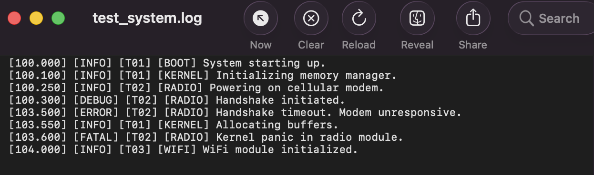
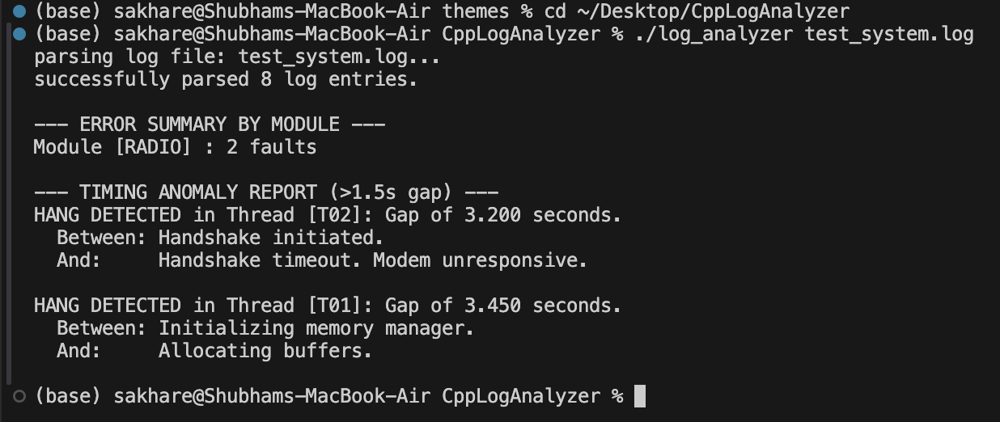

# C++ Log Analyzer & Debug Trace Tool

## Overview
I built this command-line Log Analyzer to efficiently parse, structure and evaluate system-level hardware and software logs. When dealing with embedded systems, tracking down timing anomalies or repeated faults across various threads and modules is critical. I designed this tool to automate that process, providing quick diagnostic summaries directly in the terminal.

## Key Features
* **Custom File Parser:** I wrote a lightweight parser using standard C++ string manipulation to extract timestamps, thread IDs, module names and error levels without relying on heavy external Regex libraries.
* **Fault Aggregation:** The tool automatically isolates `ERROR` and `FATAL` log entries and groups them by the originating hardware/software module.
* **Timing Anomaly Detection:** I implemented a tracking algorithm that calculates the delta between timestamps on a per-thread basis to detect system hangs, deadlocks, or delayed handshakes (e.g., flagging any thread gap larger than 1.5 seconds).

## Output



*(Below is a demonstration of the tool parsing a standard system log, identifying a kernel panic in the radio module and flagging a 3.2-second handshake timeout.)*



## Technical Stack
* **Language:** C++17
* **Standard Libraries Used:** `<iostream>`, `<fstream>`, `<vector>`, `<unordered_map>`, `<string>`, `<iomanip>`
* **Environment:** macOS / Clang / VS Code
* **Dependencies:** None. I specifically designed this to rely strictly on the C++ Standard Library to ensure maximum portability.

## How I Built It
I structured the project using Object-Oriented principles to ensure it is extensible. 
1. `LogEntry.h`: Defines the core data structure to represent a single parsed log line in memory.
2. `Parser`: Handles file I/O and state-machine-based string extraction. I optimized this to ignore empty lines and gracefully handle malformed log entries.
3. `Analyzer`: Houses the business logic. It utilizes `std::unordered_map` for O(1) average time complexity lookups when grouping logs by thread ID and module name.

## How to Run Locally

1. Clone the repository:
   ```bash
   git clone https://github.com/ShubhamSakhareGEM/cpp-log-analyzer.git
   ```

2. Navigate into the directory:
   ```bash
   cd cpp-log-analyzer
   ```

3. Compile the code using Clang/GCC:
   ```bash
   clang++ -std=c++17 main.cpp Parser.cpp Analyzer.cpp -o log_analyzer
   ```

4. Run the executable against the provided test log:
   ```bash
   ./log_analyzer test_system.log
   ```

## Future Enhancements
In future iterations, I plan to optimize the file ingestion process for massive log files (GBs in size) by implementing memory-mapped files or utilizing `std::string_view` to reduce memory allocation overhead during string copying.
